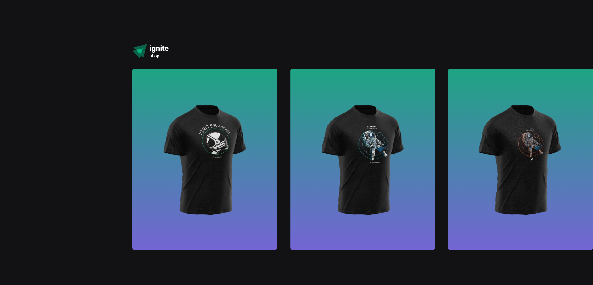

<div align="center">
  
</div>



<div align="center">
  <p>
    <a href="#-technologies">Technologies</a>&nbsp;&nbsp;&nbsp;|&nbsp;&nbsp;&nbsp;
    <a href="#-getting-started">Getting started</a>&nbsp;&nbsp;&nbsp;|&nbsp;&nbsp;&nbsp;
    <a href="#-license">License</a>
  </p>
</div>

## ✨ Technologies

<div align="center">
  <br />
  
  
  
  
  <br />
</div>

This project was developed with the following technologies:

- [TypeScript](https://www.typescriptlang.org/)
- [NextJS](https://nextjs.org)
- [Axios](https://axios-http.com/ptbr/)
- [Stripe](https://stripe.com/br)

## 💻 Getting started

### Requirements

- You need to install both [Node.js](https://nodejs.org/en/download/)

**Clone the project and access the folder**

```bash
$ git clone https://github.com/thoomassf/04-ignite-shop && cd 04-ignite-shop
$ gh repo clone thoomassf/04-ignite-shop && cd 04-ignite-shop
```

**Follow the steps below**

```bash
# Install dependencies
$ npm install
# Start the project
$ npm run dev
```

The app will be available for access in your browser at `http://localhost:3000/`

## 📝 License

This project is licensed under the MIT License - see the [LICENSE](LICENSE) file for details.

---

by Thomas Farias 👋 [Check out my LinkedIn](https://www.linkedin.com/in/thomas-sf)